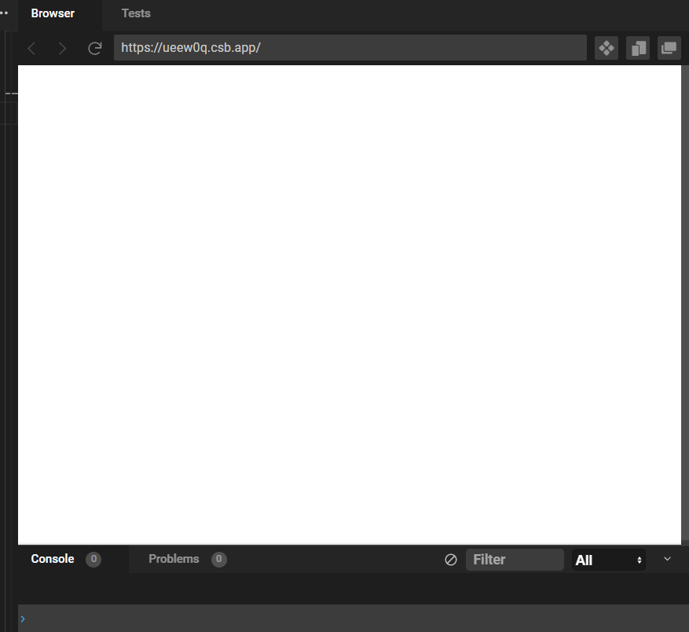
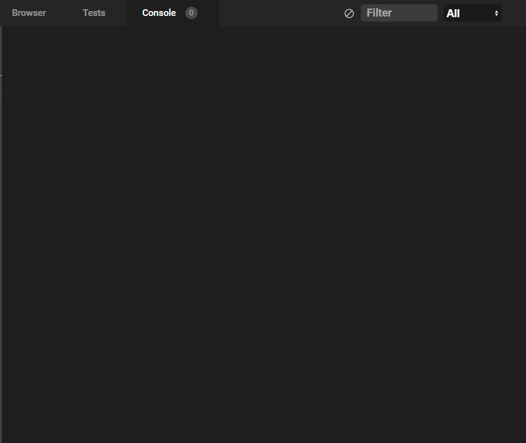

# JavaScript 공부하기

> [이 링크](https://learnjs.vlpt.us/basics/02-variables.html)에서 제공해주는 내용을 하나씩 하나씩 차례로 공부할 것임! 

### 1장. 자바스크립트 입문

#### 01. Hello, JavaScript

- 자바스크립트는 따로 프로그램을 설치할 필요없이 브라우저의 개발자 도구 console 창에서 실행할 수 있음. 

  - `console.log('Hello, JavaSript!')`, `console.log(1+2+3)` 를 크롬 콘솔창(f12)에서 실행해보자.
- `console.log` 명령어는 console창에 입력된 내용을 띄움.
  - 브라우저에서 `about:blank`에 접속해서 실행하면 깔끔한 상태에서 시작할 수 있음.

  

- 그러나 매번 코드를 작성할 때마다 개발자 도구창에 접속하는 것은 불편함. 이때 활용 가능한 사이트가 있음! 바로 [CodeSandbox](https://codesandbox.io/dashboard/home?workspace=4b81ef1a-1849-486e-a4fe-b5d02b9c09a6)라는 사이트임. 코드를 작성하고 바로 결과물을 확인할 수 있다. 깃헙과도 연동할 수 있어서 유용한 듯. 

- 처음 오른쪽에 뜨는 창은 다음과 같이 위에는 흰페이지, 아래에 결과물이 출력되는 콘솔창이 있는데, 흰페이지는 HTML 결과물을 보여주므로 지금은 딱히 볼 필요가 없음. 아래 콘솔창 결과물이 더 중요.

- 이렇게 콘솔창탭을 옆에 위쪽에 끌어올려 옆에 추가해서 콘솔창만 띄워놓고 보는 것이 편함. 

